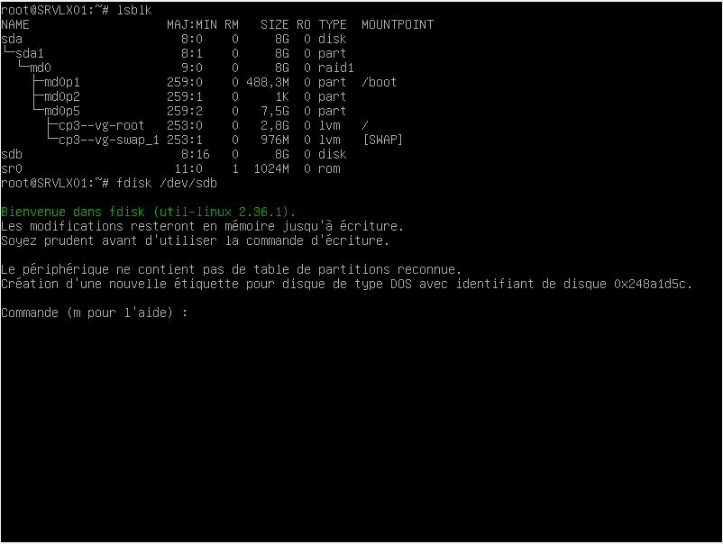

# Exercice 2 : Manipulations pratiques sur VM Linux (temps estimé : 2h30)
Pour cet exercice tu as besoin de la VM SRVLX01.

## Partie 1 : Gestion des utilisateurs
#### Q.2.1.1 Sur le serveur, créer un compte pour ton usage personnel.

Ajout d'un compte utilisateur avec la commande `adduser`
 

#### Q.2.1.2 Quelles préconisations proposes-tu concernant ce compte ? 
_Effectuer en dehors du temps imparti_
Je préconise de faire de ce nouveau compte un compte administrateur avec la commande suivante `usermod -aG sudo anthony`  

## Partie 2 : Configuration de SSH
Un serveur SSH est lancé sur le port par défaut.
Il est possible de s'y connecter avec n'importe quel compte, y compris le compte root.

#### Q.2.2.1 Désactiver complètement l'accès à distance de l'utilisateur root.

Création d'un fichier backup avant modification du fichier `ssh_config`
 

Refuser la permition de connexion en tant que Root
 
 
#### Q.2.2.2 Autoriser l'accès à distance à ton compte personnel uniquement.
_Effectuer en dehors du temps imparti_
 


#### Q.2.2.3 Mettre en place une authentification par clé valide et désactiver l'authentification par mot de passe
 

## Partie 3 : Analyse du stockage
#### Q.2.3.1 Quels sont les systèmes de fichiers actuellement montés ?
_Effectuer en dehors du temps imparti_
Les types de fichiers montés sont :
- devtmpfs  
- tmpfs  
- ext4  
- ext2  
 

#### Q.2.3.2 Quel type de système de stockage ils utilisent ?

Les types de système de stockage utilisés sont RAID1 et LVM
 

#### Q.2.3.3 Ajouter un nouveau disque de 8,00 Gio au serveur et réparer le volume RAID
 

#### Q.2.3.4 Ajouter un nouveau volume logique LVM de 2 Gio qui servira à héberger des sauvegardes. Ce volume doit être monté automatiquement à chaque démarrage dans l'emplacement par défaut : /var/lib/bareos/storage.

Utilisation de la commande `lsblk` pour vérifier les disques.
Pour créer la partition LVM sur notre disque, il faut saisire la commande suivant :
```bash
fdisk /dev/sdb
```
 

Touche `m` pour afficher le menu et touche `n` pour ajouter une nouvelle partition.

#### Q.2.3.5 Combien d'espace disponible reste-t-il dans le groupe de volume ?
_Effectuer en dehors du temps imparti_

## Partie 4 : Sauvegardes
Le logiciel bareos est installé sur le serveur.
Les composants bareos-dir, bareos-sd et bareos-fd sont installés avec une configuration par défaut.

#### Q.2.4.1 Expliquer succinctement les rôles respectifs des 3 composants bareos installés sur la VM.
_Effectuer en dehors du temps imparti_
`bareos-dir` :   **Bareos Director**  
Il est responsable de la planification, du contrôle et du lancement des tâches de sauvegardes. Il contrôle l'ensemble des autres composants. Il est installé sur le serveur en charge de la gestion des sauvegardes.  

`bareos-sd` :  **Bareos Storage Daemon**  
Bareos permet d'effectuer des sauvegardes sur différents types de supports (bandes magnétiques, disques, stockage distant...). L'écriture sur ces supports est effectué par un Storage Daemon.
Il peut donc y en avoir plusieurs, si on souhaite par exemple que les sauvegardes soient hébergées sur les disques de plusieurs machines.
Une tâche de sauvegarde est donc lancée par le Director qui met en relation un File Daemon présent sur la machine à sauvegarder avec un Storage Daemon présent lui sur la machine qui enregistrent les informations de la sauvegarde sur un support de stockage.

`bareos-fd` :  **Bareos File Daemon**  
Ce composant est installé sur chaque machine devant être sauvegardée.
Il est en charge de collecter les informations à sauvegarder et de les envoyer au Bareos Storage Daemon


## Partie 5 : Filtrage et analyse réseau
#### Q.2.5.1 Quelles sont actuellement les règles appliquées sur Netfilter ?
 

#### Q.2.5.2 Quels types de communications sont autorisées ?
_Effectuer en dehors du temps imparti_
- Les paquets faisant partie d'une connexions déjà établies.
- Le trafic local.
- Les connexions SSH port 22.
- Les messages ICMP ipv4 et ipv6.

#### Q.2.5.3 Quels types sont interdit ?
_Effectuer en dehors du temps imparti_
- Les nouveaux paquets
- Tout autre trafic ou connexion qui n'a pas été autorisé à la question précédente.

#### Q.2.5.4 Sur nftables, ajouter les règles nécessaires pour autoriser bareos à communiquer avec les clients bareos potentiellement présents sur l'ensemble des machines du réseau local sur lequel se trouve le serveur.
_Effectuer en dehors du temps imparti_

## Partie 6 : Analyse de logs
#### Q.2.6.1 Lister les 10 derniers échecs de connexion ayant eu lieu sur le serveur en indiquant pour chacun :

La date et l'heure de la tentative  
L'adresse IP de la machine ayant fait la tentative  

